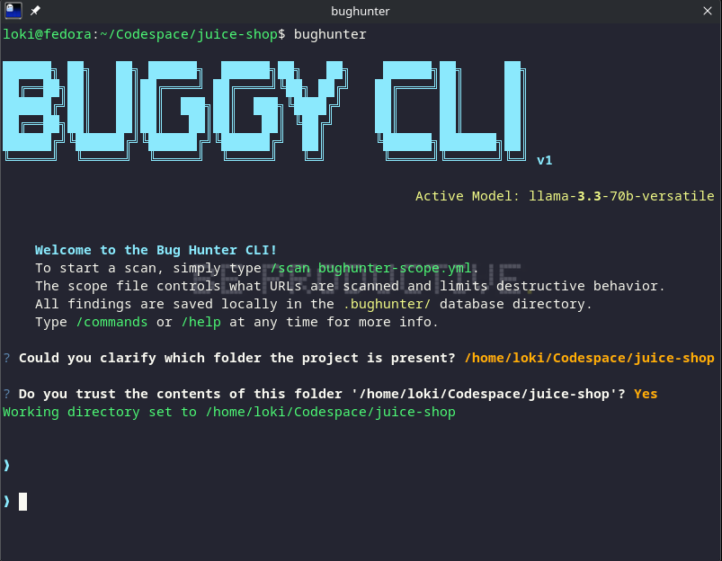
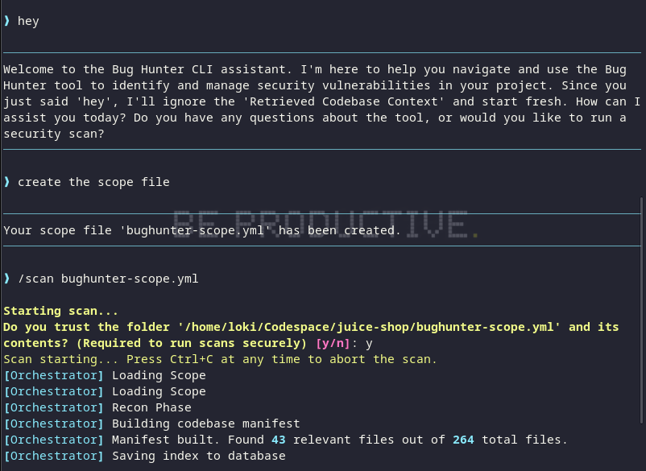

<div align="center">
  <h1>🛡️ Bug Hunter CLI</h1>
  <p><strong>The Autonomous, Agentic SAST/DAST Vulnerability Scanner</strong></p>
  <p>
    <a href="https://pypi.org/project/bug-hunter-cli/"></a>
    
    
    
  </p>
  <br>
  
</div>

---

## 📖 What is Bug Hunter CLI?

Bug Hunter CLI is a next-generation cybersecurity tool that acts as an autonomous application security engineer. Built on **LangGraph**, it orchestrates a team of specialized AI Agents to perform both **Static Application Security Testing (SAST)** and **Dynamic Application Security Testing (DAST)** on your codebase.

Unlike traditional scanners that rely purely on rigid regex patterns and brute-force fuzzing, Bug Hunter *reads and understands* your code contextually, allowing it to find complex business logic flaws and safely validate them over the network with a near-zero false-positive rate.

It is **Stack Agnostic**, meaning it works perfectly against Python, Node.js, Java, Go, Ruby, and PHP applications.

---

## ✨ Key Capabilities & What it Finds

Bug Hunter CLI is designed to provide comprehensive coverage across your application stack:

### 1. OWASP Top 10 (Static & Dynamic)
Using a combination of Semgrep and AI evaluation, it catches structural vulnerabilities:
*   **Injection:** SQLi, NoSQLi, Command Injection, LDAP Injection.
*   **XSS & CSRF:** Cross-Site Scripting and Request Forgery.
*   **Broken Access Control:** Path Traversal, Open Redirects, Directory Listing.

### 2. Business Logic Flaws (AI Auditing)
Because the AI understands the *intent* of your code, it excels at finding things regular tools miss:
*   Authorization bypasses (User A accessing User B's cart).
*   Improper JWT revocation and validation.
*   Hardcoded secrets and API keys.

### 3. Software Composition Analysis (SCA)
*   Automatically parses your `package.json` and runs localized `npm audit` scans to flag High and Critical CVEs lurking in your third-party dependencies.

---

## 🧠 The Agentic Workflow (How it Works)

The pipeline is driven by a state machine of specialized agents:

1.  **Recon Agent:** Builds an intelligent manifest of your repository, mapping out routes, models, and controllers. Creates a local vector database for Retrieval-Augmented Generation (RAG).
2.  **Static Audit Agent:** Executes Semgrep to find structural flaws, then feeds those snippets into an LLM to filter out false positives.
3.  **SCA Agent:** Audits your dependencies (e.g., `package.json`) to find known CVEs.
4.  **Planner Agent:** Reads the confirmed static findings and drafts a highly-targeted Dynamic Test Plan.
5.  **Dynamic Test Agent (Safe-Active):** Safely executes HTTP requests against your live environment to prove if a static vulnerability is actually exploitable.
6.  **Vuln Scoring Agent:** Uses a proprietary weighted algorithm to score the risk.
7.  **Fix Agent:** Generates specific, copy-pasteable code patches to resolve the vulnerabilities.

---

## 🧮 The Scoring System

Every finding receives a **VulnScore (0-100)** to help you prioritize remediation. The score is calculated using four weighted metrics:

*   **CVSS Base (35%):** The inherent technical severity of the vulnerability type.
*   **AI Confidence (25%):** How certain the AI is that this is a true positive.
*   **Evidence Weight (20%):** A heavy boost if the *Dynamic Test Agent* successfully exploited it over HTTP vs just spotting it in code.
*   **Remediation Penalty (12%):** A minor boost if the fix is complex or requires architectural changes.

---

## 🚀 Installation & Usage

Bug Hunter CLI is published on PyPI. You do not need to clone the repository to use it!

```bash
# Install globally via pip
pip install bug-hunter-cli==0.1.1
```

### Starting a Scan
To run a scan against your project, simply create a `bughunter-scope.yml` file in the root of your project:

```yaml
project:
  name: "My Secure App"
  repo_path: "."
targets:
  urls: 
    - "http://localhost:3000"
scan:
  mode: safe-active  # Options: passive, safe-active, lab-validation
```

Then, run the scanner:
```bash
bughunter scan --scope bughunter-scope.yml
```

<div align="center">
  
</div>

You will receive a beautifully formatted **Markdown Report** in the `.bughunter/reports` folder, and a live, interactive TUI terminal output!

---

## 🤖 MCP Server Integration (LLM API)

Bug Hunter CLI comes with a built-in **Model Context Protocol (MCP)** server. You can hook it directly into AI IDEs (like Cursor or Windsurf) or desktop apps (like Claude Desktop) so your AI assistant can run scans for you autonomously.

Add this to your MCP configuration:
```json
{
  "mcpServers": {
    "bughunter": {
      "command": "bughunter-mcp",
      "args": []
    }
  }
}
```

---

## 🛠️ Technology Stack
*   **Core:** Python 3.12+, Pydantic V2 (Hexagonal Architecture)
*   **AI & Agents:** LangGraph, LangChain, ChromaDB (Vector Search)
*   **UI/UX:** Typer (CLI), Textual & Rich (Terminal UI)
*   **Scanners:** Semgrep, NPM Audit
*   **LLM Support:** Groq, OpenAI, Google Gemini
